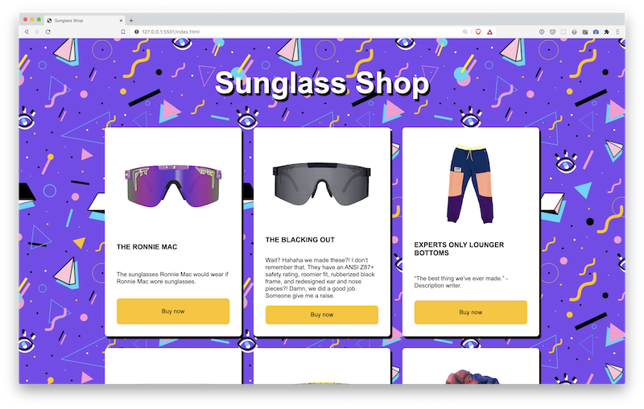

# 01 Exercise - Sunglass Shop - Use Loops to display elements

## Brief

Currently, in your web store, you are displaying all the products by manually selecting each element from the `products` array. What happens if we add a new product? We will have to update our JavaScript to be able to display it.

Fortunately, JavaScript has a feature where you can automatically loop over an array. Use a `for...of` loop to display the products, replacing the current implementation.

## Rationale

Using Loops is a powerful way to keep your code flexible and resilient to data structures getting bigger, and also allows you to write less code by having the programming language deal with repeating tasks through a list.

## Instructions - Create and append products

1. The automated tests are already passing for this exercise. Your job is to [refactor](https://www.martinfowler.com/bliki/DefinitionOfRefactoring.html) (change the existing code) without breaking the existing tests.
1. Open `Submission/script.js` in VS Code, and `Submission/index.html` in Live Server
2. In `script.js`, change the code to use a `for...of` loop, instead of manually appending each item from the array one by one.
3. When complete, you should see all the products displayed on the page, the same as when you first loaded the project.
4. Ensure the automated tests are still passing

---

# Submit your Exercise

- [ ] Commits are pushed to GitHub
- [ ] Automated tests pass in GitHub

---

## Exercise answer walkthrough

- [Sunglass Shop - Using loops to display elements exercise walkthrough](https://www.loom.com/share/9e6e7d96f21e4a50b172ef8c591af179)